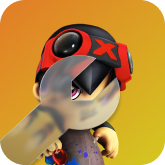

#  KartPatcher

KartPatcher is a tool to patch ModNation Racers on PS3 to connect to custom servers.

# Usage
Go to Releases and download the latest build for Windows.
1. Run the executable.
2. Fill out the forms, like your PS3's IP address, the PlayerConnect Server URL/IP, the BombServer IP, and the title ID of the game (If you don't know, click the ? button beside the textbox.)
3. Click "Patch my ModNation!" and wait for the patching process to finish.
4. Go to your PS3 and launch the game. You should be connected to your desired custom server.